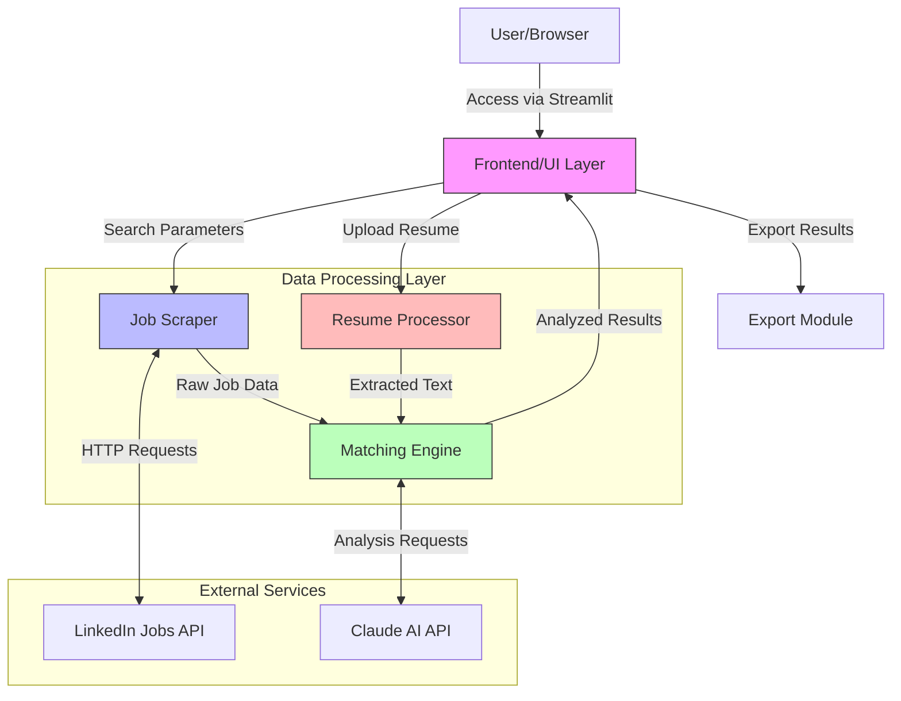

# Job Match Pro - System Architecture

## System Overview Diagram

## Component Descriptions

### 1. Frontend/UI Layer (Streamlit)
- **Location**: `main.py`
- **Responsibilities**:
  - Provides user interface for job search parameters
  - Handles resume file uploads
  - Displays job matches and analysis results
  - Manages session state and progress updates
  - Offers export functionality for results

### 2. Job Scraper
- **Location**: `job_scraper.py`
- **Responsibilities**:
  - Scrapes job listings from LinkedIn
  - Handles pagination and rate limiting
  - Extracts job details (title, company, description)
  - Provides fallback sample data
  - Error handling and logging

### 3. Resume Processor
- **Location**: `resume_processor.py`
- **Responsibilities**:
  - Processes uploaded PDF resumes
  - Extracts text content
  - Performs basic text cleanup
  - Error handling for file processing

### 4. Matching Engine
- **Location**: `matching_engine.py`
- **Responsibilities**:
  - Coordinates job matching analysis
  - Integrates with Claude AI for intelligent matching
  - Calculates match scores
  - Provides detailed match reasoning
  - Sorts and ranks job matches

### 5. Export Module
- **Location**: `utils.py`
- **Responsibilities**:
  - Handles data export to CSV
  - Selects relevant columns for export
  - Formats data for download

## Data Flow

1. **User Input Flow**:
   - User uploads resume and sets search parameters
   - Frontend validates inputs and initiates search

2. **Job Search Flow**:
   - Job Scraper fetches listings from LinkedIn
   - Results are processed and structured
   - Real-time progress updates shown to user

3. **Analysis Flow**:
   - Resume text is extracted and processed
   - Jobs are analyzed against resume
   - Claude AI provides match scoring and reasoning
   - Results are sorted by match quality

4. **Output Flow**:
   - Matched jobs displayed with scores
   - Detailed analysis shown for each match
   - Export option for saving results

## Key Features

1. **Intelligent Matching**:
   - AI-powered job analysis
   - Comprehensive match reasoning
   - Score-based ranking

2. **Real-time Processing**:
   - Progressive job loading
   - Live analysis updates
   - Interactive filtering

3. **Data Management**:
   - Session state persistence
   - Efficient data caching
   - Error handling and recovery

4. **User Experience**:
   - Intuitive interface
   - Progress tracking
   - Flexible search parameters
   - Export capabilities
